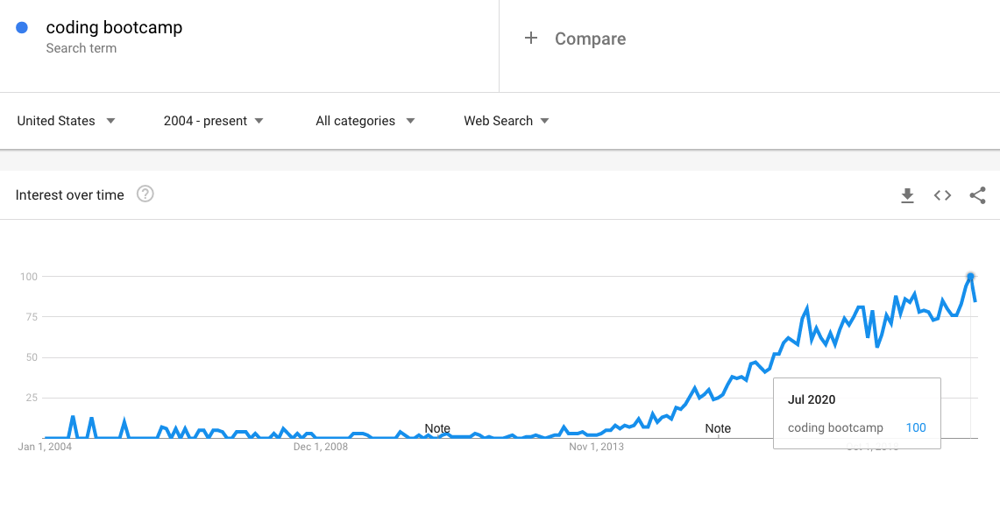

A value of 100 is the peak popularity for a term on Google Trends over a given period of time. With millions of people losing their jobs, interest in bootcamps has never been higher than it was in July of 2020.

### Wait, what do I know?
  After working in restaurants for a decade, I started having back issues in 2017. 
  On top of that, I was no longer finding any joy in the work I was doing. I was desperate for a career change.
  - After doing very little research, and even less coding, I signed up to attend a 3 month immersive coding bootcamp at [General Assembly](https://generalassemb.ly/education/software-engineering-immersive/atlanta "General Assembly").
  - 1 week after my graduation, I got my first full time software engineering role. 
  - I have experience with the other side of the bootcamp business.
      - I worked as a teaching assistant at the [Georgia Tech Coding Boot Camp](https://bootcamp.pe.gatech.edu/coding "Georgia Tech Coding Boot Camp")
      - I was offered a teaching assistant position at General Assembly on a track to be a lead instructor.
      - I've been interviewed to be a lead instructor at [Digital Crafts](https://www.digitalcrafts.com/ "Digital Crafts").
  - I started working as a software engineer for an insurance software company after my contract at my first job ended which is where I still work today.

### How much do coding bootcamps cost?
  According to Course Report coding bootcamps on average cost [$13,584](https://www.coursereport.com/reports/coding-bootcamp-market-size-research-2019 "").
  Going to General Assembly cost me $15,000, and Digital Crafts's immersive course costs the same amount. Georgia Tech's program costs $10,000. 

### What are you getting for the money?
  - Pre-Course Work 
    - A self-guided course to get you up to speed on HTML, CSS, and JavaScript fundamentals.
  - Curriculum
    - Usually, some kind of JavaScript centric approach to learning full-stack development.
  - Instruction from Industry Professionals
    - People with professional experience writing software. They don't necessarily have any education background.
  - The drive you get from the excitement of your peers.
    - Much of this benefit is lost when attending an online bootcamp.
  - Career Services.
    - Someone who gives you basic guidance about how to write a resume / interview / look for jobs. 
  - Demo Day 
    - A day to show off your projects to potential employers in person. Again, this benefit is not as great online.
  - Access to the bootcamp's professional network.

#### Pre-Course Work & Curriculum
There is absolutely nothing in any bootcamp's curriculum that cannot be found online for free. I would say the biggest thing they did for me was give me all the info in one nice neat package. Before my bootcamp,
I didn't know where to look for this kind of information, or what I was even looking for. 
[freeCodeCamp.org](https://www.freecodecamp.org/ "freeCodeCamp.org") is a great place to start if you're looking for a way to learn web development that doesn't cost 5 figures. 
You will actually learn more about HTMl and CSS from them, which are afterthoughts at bootcamps. JavaScript is almost always the focus.  
#### Instruction
My cohort at General Assembly had really phenomenal instructors. One of the classes I worked in at Trilogy had an instructor
who told everyone in class on the first day that he didn't like people. The other only had a few years of experience in the industry,
and was himself a bootcamp grad. The range of instructor quality in bootcamps is massive. I think one of the most important
things you can do when looking into a bootcamp is demand to meet or look into the background of the person or people who will be teaching
the class. 
#### Classmates
The people you end up in class with matter. Unfortunately, unless you're attending a bootcamp with someone you know, this is one aspect you have no control over. My class was filled with highly motivated, supportive students. I have taught in and seen other cohorts where that wasn't the case. 
Many people get disillusioned with the bootcamp company, and hold animosity towards them. Others start struggling to 
understand more difficult concepts because the pace of the classes are so fast. They resign themselves in a rut where they assume
they'll never learn the concepts. They're locked in to the tuition so they continue with the class anyway.
#### Career Services and Demo Days
Of all the things you pay for in a bootcamp, this is the one thing that people are most disappointed in.
Our career counselor at General Assembly was completely scatterbrained. She was an online dating coach, and we felt like her main priority was helping people get Tinder matches. We had 0 confidence in her. I did not personally see or take part in Trilogy's career
program, but the students complained about it frequently. 
The same is true for Demo Days.
My cohort spent days preparing, and many of my talented classmates were lucky if they spoke to 3 employers.
Bootcamps will sell you on the idea that they are gonna put you in touch with these companies and help you get hired.
#### pRoFeSsIoNaL nEtWoRkS
The schools tout their professional networks, but they don't really exist. The only "Network" General Assembly
really had was their connections on linkedin. The few companies who showed up to the demo day were the network I guess.
You will be fending for yourself in your job search. Your classmates and your own network will be the most 
valuable tool you have in finding a job. If I could do it all over, I would have goten on twitter and started putting myself
out there and talking about what I was learning EVERY DAY. 

### So, Are Coding Bootcamps Worth The Money?
  I think if the stars align and you have the best case scenario, then, well... not really.
  I genuinely believe my cohort at General Assembly was as good as it gets. The instructors were great.
  We had 2 instructors in the class for the entire course, and only about 20 students. My class was extremely motivated.
  They encouraged one another and worked through challenges together. From my experience, this is extremely rare.

